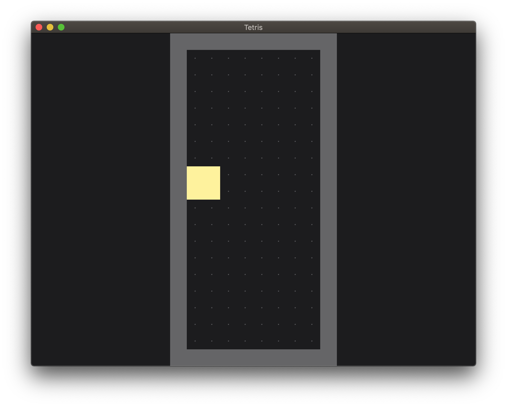

# Tetris-rs

[](http://hits.dwyl.io/mrrobb/tetris-rs)
[](https://travis-ci.org/MrRobb/tetris-rs)
[](https://github.com/mrrobb/tetris-rs/issues)

> **This is in a VERY early stage.** Come back in a couple of weeks. I am working in a refactoring of [this](https://github.com/MrRobb/Artificial-Intelligence/tree/master/Tetris%20AI) but made in [Rust](https://www.rust-lang.org) which is basically C++ but with steroids.

### Description

It is a cross-platform Tetris environment with an _extremely_ simple AI that evolves with genetic algorithms. Nothing too fancy. Yet.

The progress of the project can be seen [here](https://github.com/MrRobb/tetris-rs/projects/1).



### Download

I have barely started it so, **I will upload binaries once it is finished**.

### Build

#### Install Rust

On Linux and macOS systems, this is done as follows:

```sh
curl https://sh.rustup.rs -sSf | sh
```

On Windows, download and run [rustup-init.exe](https://win.rustup.rs/). It will start the installation in a console and present the above message on success.

#### Build the project

_You definitely do not want to this._ 

```sh
cargo build                 # debug
cargo build --release       # release
```

### Usage

_You definitely do not want to this._

```sh
cargo run                   # debug
cargo run --release         # release
```
